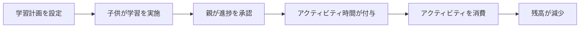
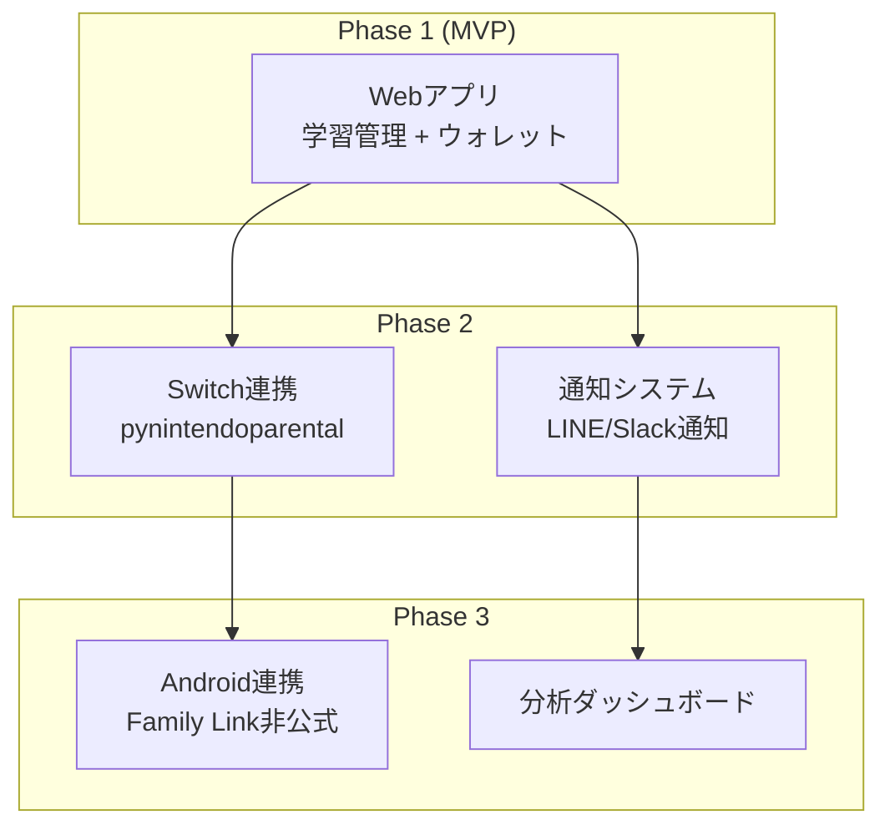
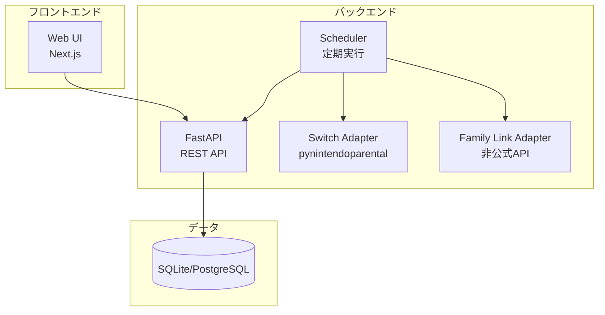

# Study to Activity (S2A) - Product Requirements Document

> **バージョン**: v0.1 (Draft)
> **作成日**: 2026-02-21
> **プロダクトオーナー**: angie
> **ステータス**: 初期検討中

---

## 1. プロダクトビジョン

**「勉強のがんばりが、遊びの時間に変わる」** ── 小学生の学習進捗を管理し、達成度に応じてタブレットやNintendo Switchなどのアクティビティ時間を自動的に付与・制御する家庭内プロダクト。

### 1.1 解決する課題

| 課題                     | 現状                                 | 目指す姿                             |
| ------------------------ | ------------------------------------ | ------------------------------------ |
| 学習進捗の把握           | 親が口頭で確認し、記憶に頼る         | アプリで進捗を可視化・記録           |
| アクティビティ時間の管理 | 都度交渉、ルールが曖昧になりがち     | ルールベースで自動計算、公平性を担保 |
| スクリーンタイム制御     | 手動でペアレンタルコントロールを操作 | 進捗に連動して自動制御               |
| 子供のモチベーション     | 勉強のご褒美が不透明                 | がんばりが即座に可視化→ゲーム感覚    |

### 1.2 ターゲットユーザー

- **親（管理者）**: 学習計画の設定、ルール定義、進捗確認
- **子供（利用者）**: 学習進捗の自己管理、アクティビティ残高の確認

---

## 2. コアコンセプト

### 2.1 基本フロー



### 2.2 アクティビティ時間の付与ルール（例）

| トリガー                 | 付与時間 | 備考                     |
| ------------------------ | -------- | ------------------------ |
| 当日の宿題をすべて完了   | 30分     | 毎日リセット             |
| 学習計画を1時間分実施    | 30分     | 計画に対する進捗率で判定 |
| テストで目標点以上を達成 | 60分     | ボーナス報酬             |
| 1週間連続で計画達成      | 120分    | 週末ボーナス             |

> [!NOTE]
> ルールは親が自由にカスタマイズ可能とする。上記はデフォルトテンプレート。

### 2.3 アクティビティ残高の概念

- **「アクティビティウォレット」**: 付与された時間がウォレットに貯まる
- **消費**: アクティビティを使用すると残高が減る
- **有効期限**: 当日分 / 繰越可能分の2種類（設定可能）
- **上限**: 1日あたりの最大アクティビティ時間を設定可能

---

## 3. 機能要件

### 3.1 MVP（Phase 1）- コア機能

#### 3.1.1 学習計画管理

- 週間/日間の学習計画を作成（科目、内容、所要時間）
- 宿題の登録と完了マーク
- 反復学習（ドリルなど）のテンプレート化

#### 3.1.2 進捗トラッキング

- 学習タスクの開始/完了を記録
- タイマー機能（学習時間の計測）
- 親による承認フロー（ワンタップ承認）

#### 3.1.3 アクティビティウォレット

- 付与ルールの設定（CRUD）
- 残高の表示・履歴
- 手動での時間追加/減算（親のみ）

#### 3.1.4 ダッシュボード

- 子供向け: 今日のタスク一覧、アクティビティ残高、進捗バー
- 親向け: 週間サマリー、承認待ちタスク、ルール管理

### 3.2 Phase 2 - デバイス連携

#### 3.2.1 Nintendo Switch ペアレンタルコントロール連携

- `pynintendoparental` ライブラリを使用
- 付与された時間に基づき日次のプレイ時間上限を自動更新
- プレイ時間モード: `ALARM`（警告のみ）/ `FORCED_TERMINATION`（強制終了）
- 認証: Nintendo アカウントのセッショントークン

#### 3.2.2 タブレット スクリーンタイム連携

**Android (Google Family Link)**:

- 非公式Pythonパッケージ経由で制御
- 日次スクリーンタイム上限の設定
- リスク: API変更時の破損

**iOS/iPadOS (Apple Screen Time API)**:

- ネイティブiOSアプリの開発が必要
- FamilyControls / ManagedSettings / DeviceActivity フレームワーク
- Apple Developer Entitlement が必要
- Family Sharing の設定が前提

### 3.3 Phase 3 - 高度な機能

- 学習分析（科目別の学習時間推移、弱点分析）
- AIによる学習計画の最適化提案
- 複数子供の管理
- カレンダー連携（学校行事、テスト日程）

---

## 4. 技術フィージビリティ調査

### 4.1 Nintendo Switch 連携

| 項目           | 詳細                                                          |
| -------------- | ------------------------------------------------------------- |
| **ライブラリ** | `pynintendoparental` (Python)                                 |
| **機能**       | プレイ時間上限設定、制限モード変更、ベッドタイム設定、PIN変更 |
| **認証**       | セッショントークン（対話型ログインで取得）                    |
| **制約**       | コンソール単位の設定（ユーザー別設定不可）、非公式API         |
| **実現可能性** | ⭐⭐⭐⭐ 高い（ライブラリが成熟）                             |
| **リスク**     | Nintendo側のAPI変更で動作しなくなる可能性                     |

### 4.2 Android タブレット連携 (Google Family Link)

| 項目           | 詳細                                               |
| -------------- | -------------------------------------------------- |
| **ライブラリ** | 非公式Pythonパッケージ、Home Assistant Integration |
| **機能**       | スクリーンタイム上限、アプリ制限、リモートロック   |
| **認証**       | Googleアカウント認証                               |
| **制約**       | 公式APIなし、非公式ライブラリの安定性に依存        |
| **実現可能性** | ⭐⭐⭐ 中程度                                      |
| **リスク**     | Google側の変更で破損するリスクが高い               |

### 4.3 iOS/iPadOS タブレット連携 (Apple Screen Time)

| 項目               | 詳細                                                 |
| ------------------ | ---------------------------------------------------- |
| **フレームワーク** | FamilyControls / ManagedSettings / DeviceActivity    |
| **機能**           | アプリシールド、時間制限スケジュール、使用監視       |
| **認証**           | Apple Developer Entitlement + Family Sharing         |
| **制約**           | ネイティブiOSアプリ開発が必須、Entitlement取得要     |
| **実現可能性**     | ⭐⭐ 低い（開発コストが高い）                        |
| **リスク**         | Apple審査プロセス、家庭内利用のみでもEntitlement必要 |

### 4.4 推奨アプローチ



---

## 5. 技術アーキテクチャ（案）

### 5.1 技術スタック

| レイヤー       | 技術                                  | 理由                                         |
| -------------- | ------------------------------------- | -------------------------------------------- |
| フロントエンド | Next.js (React)                       | レスポンシブ対応、タブレットでも操作しやすい |
| バックエンド   | Python (FastAPI)                      | Switch/Family Link連携がPythonライブラリ     |
| データベース   | SQLite → PostgreSQL                   | 初期はシンプルに、スケーリング時に移行       |
| 認証           | パスワード/PIN                        | 家庭内利用なのでシンプルに                   |
| ホスティング   | ローカル (Raspberry Pi等) or クラウド | 家庭内ネットワークで完結可能                 |
| スケジューラ   | APScheduler / Celery                  | 定期的な時間計算・制御の実行                 |

### 5.2 システム構成図



---

## 6. データモデル（概要）

### 主要エンティティ

```
User (親/子供)
├── StudyPlan (学習計画)
│   └── StudyTask (個別タスク)
│       ├── subject: 科目
│       ├── description: 内容
│       ├── estimated_minutes: 予定時間
│       ├── actual_minutes: 実績時間
│       └── status: 未着手/進行中/完了/承認済
├── RewardRule (報酬ルール)
│   ├── trigger_type: 宿題完了/時間達成/テスト...
│   ├── trigger_condition: 条件詳細
│   └── reward_minutes: 付与時間
├── ActivityWallet (アクティビティウォレット)
│   ├── balance_minutes: 残高（分）
│   ├── daily_limit_minutes: 日次上限
│   └── carry_over: 繰越可否
└── ActivityLog (利用履歴)
    ├── activity_type: Switch/タブレット/その他
    ├── started_at: 開始時刻
    ├── ended_at: 終了時刻
    └── consumed_minutes: 消費時間
```

---

## 7. ロードマップ

### Phase 1: MVP（4-6 weeks）

**ゴール**: 学習管理 + アクティビティウォレットの基本サイクルを回す

```
Week 1-2: バックエンド (API + DB)
  - ユーザー管理、学習計画CRUD、進捗記録
  - 報酬ルールエンジン、ウォレット管理

Week 3-4: フロントエンド (Web UI)
  - 子供向けダッシュボード（タスク一覧、残高表示）
  - 親向け管理画面（計画作成、承認、ルール設定）

Week 5-6: 統合テスト + 家庭内トライアル
  - 実際の宿題サイクルで1週間テスト運用
  - フィードバック収集と改善
```

### Phase 2: デバイス連携（2-4 weeks）

**ゴール**: Switch のプレイ時間を自動制御

```
Week 7-8: Nintendo Switch 連携
  - pynintendoparental の認証セットアップ
  - ウォレット残高 → Switch プレイ時間上限の自動同期
  - 日次リセットの自動実行

Week 9-10: 通知 + 改善
  - LINE/Slack 通知（学習完了、時間付与など）
  - Phase 1 フィードバックの反映
```

### Phase 3: 拡張（4+ weeks）

**ゴール**: タブレット連携 + 分析機能

```
- Android タブレット連携（Family Link 非公式API調査・実装）
- 学習分析ダッシュボード
- カレンダー連携
```

---

## 8. 成功指標 (KPI)

| 指標                       | 目標                | 計測方法       |
| -------------------------- | ------------------- | -------------- |
| 学習計画の達成率           | 週平均 80% 以上     | タスク完了率   |
| 親の承認作業時間           | 1日5分以内          | 操作ログ       |
| 子供の自主的なアプリ利用   | 毎日1回以上アクセス | アクセスログ   |
| アクティビティ時間の公平感 | 親子双方の満足度    | 定性ヒアリング |

---

## 9. リスクと対策

| リスク                   | 影響度 | 対策                                               |
| ------------------------ | ------ | -------------------------------------------------- |
| 非公式API の破損         | 高     | 手動フォールバックの仕組みを用意                   |
| 子供がシステムを回避     | 中     | 親の承認フローで担保                               |
| 運用が面倒で使わなくなる | 高     | UI/UXを徹底的にシンプルに、日次運用2分以内を目指す |
| 家族のモチベーション低下 | 中     | ゲーミフィケーション要素（連続達成バッジ等）       |

---

## 10. 次のステップ

1. **PRDレビュー**: このドキュメントの内容を確認・フィードバック
2. **優先順位決定**: Phase 1 の機能スコープの確定
3. **技術検証**: pynintendoparental の実際の動作確認
4. **プロトタイプ開発**: MVP の実装開始
