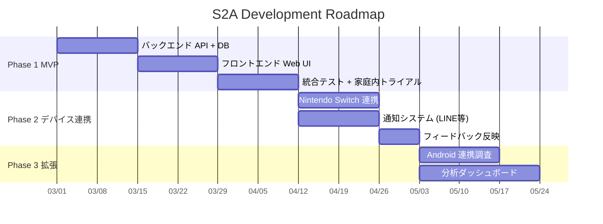

# Study to Activity (S2A) - ロードマップ

> **作成日**: 2026-02-21
> **ステータス**: 計画中

---

## ロードマップ概要

---

## Phase 1: MVP（6 weeks）

### ゴール

学習管理＋アクティビティウォレットの基本サイクルを動作させる

### スプリント構成

#### Sprint 1 (Week 1-2): バックエンド構築

| タスク                                  | 見積 | 成果物                         |
| --------------------------------------- | ---- | ------------------------------ |
| プロジェクト初期設定 (FastAPI + SQLite) | 2h   | プロジェクト構造               |
| ユーザーモデル＋認証                    | 4h   | `/api/auth/*`                  |
| 学習計画 CRUD API                       | 6h   | `/api/plans/*`, `/api/tasks/*` |
| 進捗記録 API                            | 4h   | `/api/progress/*`              |
| 報酬ルールエンジン                      | 6h   | `/api/rules/*`                 |
| アクティビティウォレット API            | 6h   | `/api/wallet/*`                |

**完了条件**: 全 API が Swagger UI でテスト可能

#### Sprint 2 (Week 3-4): フロントエンド構築

| タスク                       | 見積 | 成果物                     |
| ---------------------------- | ---- | -------------------------- |
| Next.js プロジェクト初期設定 | 2h   | アプリ骨格                 |
| 子供向けダッシュボード       | 8h   | タスク一覧 + 残高表示      |
| 学習タイマー                 | 4h   | タイマーUI + API連携       |
| 親向け管理画面               | 8h   | 計画作成、ルール設定、承認 |
| レスポンシブ対応             | 4h   | タブレットでの操作最適化   |

**完了条件**: 親子それぞれの画面が機能し、基本フローが完了できる

#### Sprint 3 (Week 5-6): テスト＋改善

| タスク                   | 見積 | 成果物                 |
| ------------------------ | ---- | ---------------------- |
| 単体テスト               | 4h   | pytest テストスイート  |
| 統合テスト               | 4h   | エンドツーエンドテスト |
| 家庭内トライアル (1週間) | -    | フィードバック記録     |
| バグ修正＋UI改善         | 8h   | 改善版リリース         |

**完了条件**: 1週間の実運用でクリティカルバグなし

---

## Phase 2: デバイス連携（4 weeks）

### ゴール

Nintendo Switch のプレイ時間を学習進捗に連動して自動制御

#### Sprint 4 (Week 7-8): Switch 連携

| タスク                              | 見積 | 成果物             |
| ----------------------------------- | ---- | ------------------ |
| pynintendoparental セットアップ     | 2h   | 認証フロー         |
| Switch Adapter 実装                 | 6h   | プレイ時間自動設定 |
| ウォレット → Switch 同期ロジック    | 4h   | スケジューラ連携   |
| エラーハンドリング + フォールバック | 4h   | 通知による手動制御 |

#### Sprint 5 (Week 9-10): 通知 + 改善

| タスク                     | 見積 | 成果物                     |
| -------------------------- | ---- | -------------------------- |
| LINE/Slack 通知連携        | 4h   | 学習完了、時間付与等の通知 |
| Phase 1 フィードバック反映 | 8h   | 改善項目の実装             |
| 運用ドキュメント整備       | 2h   | セットアップガイド         |

---

## Phase 3: 拡張（継続）

| タスク                               | 優先度 | 見積      |
| ------------------------------------ | ------ | --------- |
| Android タブレット連携 (Family Link) | 中     | 2-4 weeks |
| 学習分析ダッシュボード               | 中     | 2 weeks   |
| 複数子供管理                         | 低     | 1-2 weeks |
| カレンダー連携                       | 低     | 1 week    |
| AI 学習計画最適化                    | 低     | 3-4 weeks |

---

## マイルストーン

| マイルストーン          | 目標日  | 判定基準                        |
| ----------------------- | ------- | ------------------------------- |
| **M1**: MVP リリース    | Week 6  | 基本フローが動作                |
| **M2**: Switch 自動制御 | Week 8  | ウォレット → Switch が連動      |
| **M3**: 安定運用        | Week 10 | 2週間のクリティカルバグなし運用 |
| **M4**: 拡張リリース    | TBD     | タブレット連携 or 分析機能      |
