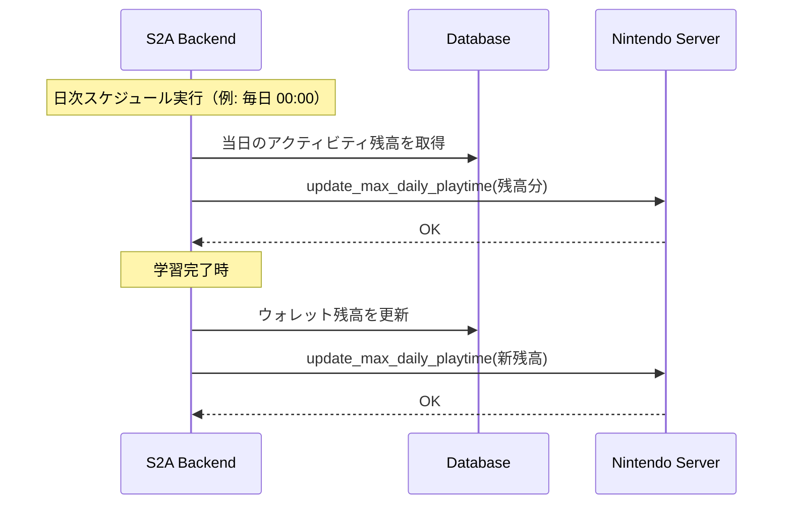

# 技術フィージビリティ調査レポート

> **作成日**: 2026-02-21
> **目的**: 外部デバイス連携の技術的実現可能性を詳細に調査し、実装方針を決定する

---

## 1. Nintendo Switch ペアレンタルコントロール連携

### 1.1 利用可能なライブラリ

#### `pynintendoparental` (Python) ⭐推奨

| 項目         | 詳細                                                                              |
| ------------ | --------------------------------------------------------------------------------- |
| **GitHub**   | github.com/pynintendoparental                                                     |
| **言語**     | Python (async)                                                                    |
| **主要機能** | プレイ時間上限設定、制限モード変更、ベッドタイム設定、PIN変更、追加プレイ時間付与 |

**主要API:**

```python
# 日次プレイ時間上限の設定
await device.update_max_daily_playtime(minutes=60)

# 制限モードの設定
await device.set_restriction_mode(RestrictionMode.ALARM)  # 警告のみ
await device.set_restriction_mode(RestrictionMode.FORCED_TERMINATION)  # 強制終了

# タイマーモード（曜日別 or 全日共通）
await device.set_timer_mode(DeviceTimerMode.EACH_DAY_OF_THE_WEEK)

# ベッドタイム設定
await device.set_bedtime_alarm(time(21, 0))

# プレイ時間上限を解除
await device.update_max_daily_playtime(-1)
```

**認証フロー:**

1. `pynintendoparental.Authenticator` を使用
2. Nintendo アカウントで対話型ログイン（初回のみ）
3. セッショントークンを取得・保存
4. トークンの有効期限管理が必要

**制約:**

- コンソール全体に適用（ユーザー別設定不可）
- 非公式API（Nintendo による変更リスク）
- セッショントークンの有効期限は不明（定期的な再認証が必要な可能性）

#### `nxapi` (JavaScript/TypeScript)

- CLI + Electron アプリ
- Discord Rich Presence 連携あり
- ペアレンタルコントロールデータの取得が可能
- バックエンドが Python の場合はサブプロセスで呼び出す必要があり、`pynintendoparental` の方が適切

### 1.2 実装方針



### 1.3 リスク評価

| リスク                | 確率 | 影響 | 対策                           |
| --------------------- | ---- | ---- | ------------------------------ |
| API変更による動作不全 | 中   | 高   | 手動制御へのフォールバック通知 |
| セッション切れ        | 中   | 中   | 自動再認証 + 失敗時の通知      |
| レート制限            | 低   | 低   | API呼び出し頻度の制限          |

---

## 2. Android タブレット連携 (Google Family Link)

### 2.1 現状

- **公式API**: 存在しない
- **非公式ライブラリ**: PyPI にパッケージが存在（安定性未検証）
- **Home Assistant Integration**: google_family_link integration が存在

### 2.2 利用可能な機能

| 機能                     | 可否 | 備考                      |
| ------------------------ | ---- | ------------------------- |
| スクリーンタイム上限設定 | △    | 非公式APIで可能だが不安定 |
| アプリ別制限             | △    | 同上                      |
| リモートロック           | △    | 同上                      |
| 使用状況の取得           | △    | 同上                      |

### 2.3 実装方針

> [!WARNING]
> Google Family Link の非公式API は安定性が低いため、Phase 3 以降での対応を推奨。
> 代替として、通知ベースの仕組み（残業時間を親にLINE通知 → 親が手動で設定）も検討。

**代替アプローチ: Android ADB を使ったローカル制御**

- 家庭内ネットワークで ADB 接続
- `adb shell` でアプリの起動制御
- ただし root 権限やデバッグモードが必要

### 2.4 リスク評価

| リスク                | 確率 | 影響 | 対策                       |
| --------------------- | ---- | ---- | -------------------------- |
| 非公式API の廃止/変更 | 高   | 高   | 通知ベースのフォールバック |
| 認証の複雑さ          | 中   | 中   | セットアップガイドの整備   |

---

## 3. iOS/iPadOS タブレット連携 (Apple Screen Time)

### 3.1 現状

Apple は公式に Screen Time API を提供しているが、ネイティブ iOS アプリの開発が必須。

**3つのフレームワーク:**

1. **FamilyControls**: 認証 + アクティビティ選択UI
2. **ManagedSettings**: アプリのシールド（使用制限の適用）
3. **DeviceActivity**: スケジュールベースの制限適用・使用監視

### 3.2 開発要件

| 要件                    | 詳細                                     |
| ----------------------- | ---------------------------------------- |
| Apple Developer Program | $99/年                                   |
| Family Sharing          | 子供のApple IDがファミリーグループに参加 |
| 専用Entitlement         | Family Controls Entitlement の申請       |
| 開発言語                | Swift (SwiftUI)                          |
| デプロイ                | TestFlight or Ad Hoc                     |

### 3.3 実装の難易度

> [!CAUTION]
> iOS 連携は開発コストが非常に高く、家庭内プロダクトの初期フェーズでは非推奨。
> Apple のエンタイトルメント審査も必要で、個人開発としてはオーバーヘッドが大きい。

### 3.4 代替アプローチ

1. **Shortcuts (ショートカット) + 通知**: S2A から通知 → 親が手動でスクリーンタイムを変更
2. **ガイド付きアクセス**: 特定のアプリだけ使えるように手動設定
3. **Web ベースのタイマー表示**: 残り時間を表示するだけ（制御はしない）

---

## 4. 総合評価と推奨

### 4.1 実装優先度マトリクス

```
                    実現可能性 高
                        │
    ┌───────────────────┼───────────────────┐
    │                   │                   │
    │  Nintendo Switch  │                   │
    │  ⭐ Phase 2      │                   │
    │                   │                   │
 影 ├───────────────────┼───────────────────┤ 影
 響 │                   │                   │ 響
 度 │  通知ベース連携    │  Android          │ 度
 高 │  ⭐ Phase 2      │  Family Link      │ 低
    │                   │  Phase 3          │
    │                   │                   │
    └───────────────────┼───────────────────┘
                        │
                    実現可能性 低
```

### 4.2 推奨実装順序

| 順序 | 連携先                | 理由                           |
| ---- | --------------------- | ------------------------------ |
| 1    | 通知連携 (LINE/Slack) | 最も低コスト、全デバイスに対応 |
| 2    | Nintendo Switch       | ライブラリが成熟、直接制御可能 |
| 3    | Android (Family Link) | 非公式だが需要高い             |
| 4    | iOS (Screen Time)     | コスト最大、優先度は低         |

---

## 5. 結論

> [!IMPORTANT]
> **Phase 1 (MVP)** 段階では外部デバイス連携は行わず、学習管理＋アクティビティウォレットのWebアプリを構築する。デバイス制御は「通知 → 親が手動設定」のフローでカバーする。
>
> **Phase 2** で Nintendo Switch 連携 (`pynintendoparental`) を実装し、最も価値の高い自動化を実現する。
>
> **Phase 3** 以降で Android/iOS 連携を段階的に検討する。
