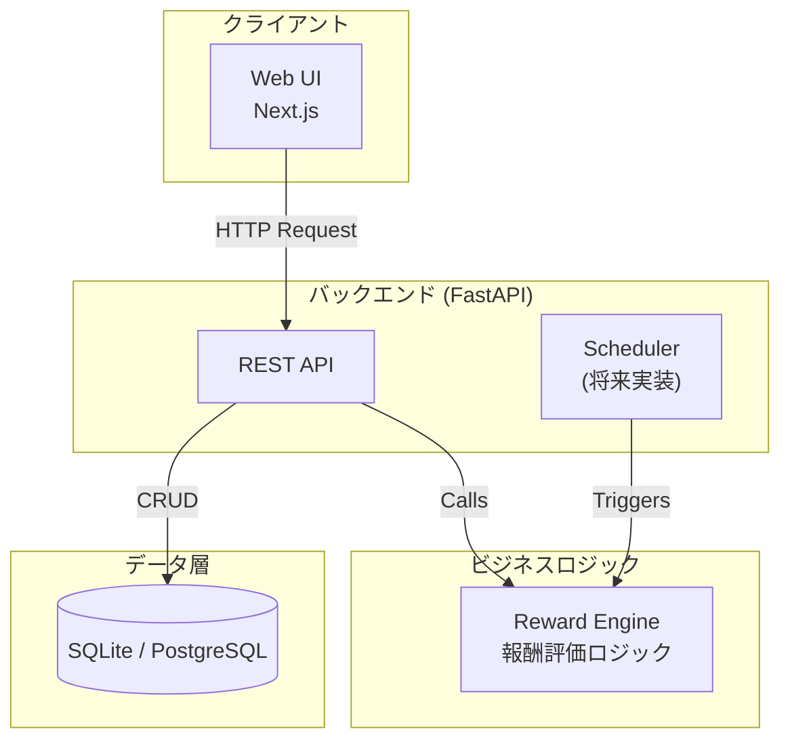

# Study to Activity (S2A) - 技術仕様書

> **バージョン**: v0.1
> **作成日**: 2026-02-21
> **ステータス**: 開発中

---

## 1. 概要

本ドキュメントは「Study to Activity (S2A)」プロジェクトのバックエンドシステムに関する技術的な仕様を定義するものです。

S2Aは、子供の学習進捗を管理し、その達成度に応じてNintendo Switchやタブレットなどのアクティビティ（遊び）時間を報酬として付与するシステムです。本仕様書は、APIの設計、データベース構造、システムアーキテクチャ、および主要なロジックについて詳述します。

## 2. システムアーキテクチャ

### 2.1 技術スタック

| レイヤー | 技術 | 理由 |
|---|---|---|
| バックエンド | Python (FastAPI) | 非同期処理に対応し、パフォーマンスが高い。また、外部連携ライブラリがPythonで豊富なため。 |
| データベース | SQLAlchemy + SQLite (初期) | ORMとしてSQLAlchemyを採用し、開発初期は手軽なSQLiteを使用。本番環境ではPostgreSQLへの移行を想定。 |
| Webサーバー | Uvicorn | FastAPI公式推奨のASGIサーバー。 |
| データ検証 | Pydantic | FastAPIに統合されており、型ヒントベースで厳密なデータ検証が可能。 |
| フロントエンド | Next.js (React) | (計画中) レスポンシブUIを効率的に構築可能。 |

### 2.2 システム構成図



### 2.3 ディレクトリ構造

```
backend/
├── main.py             # FastAPIアプリケーションのエントリポイント
├── database.py         # データベース接続とセッション管理
├── models.py           # SQLAlchemyのデータモデル定義
├── schemas.py          # Pydanticのスキーマ定義 (DTO)
├── reward_engine.py    # 報酬評価ロジック
└── routers/            # APIエンドポイントのルーティング
    ├── auth.py         # 認証・ユーザー管理
    ├── plans.py        # 学習計画
    ├── tasks.py        # 学習タスク
    ├── rules.py        # 報酬ルール
    └── wallet.py       # アクティビティウォレット
```

---

## 3. データベーススキーマ

`models.py` にて定義。主キー、外部キー、リレーションシップが設定されています。

### 3.1 Enum型

- `UserRole`: `parent`, `child`
- `TaskStatus`: `pending`, `in_progress`, `completed`, `approved`, `rejected`
- `TriggerType`: `all_homework_done`, `study_time_reached`, `task_completed`, `streak`
- `ActivityType`: `switch`, `tablet`, `other`

### 3.2 テーブル定義

| テーブル名 | カラム | 型 | 説明 |
|---|---|---|---|
| **users** | `id` (PK), `name`, `role`, `pin`, `created_at` | `Integer`, `String`, `UserRole`, `String`, `DateTime` | ユーザー情報（親または子） |
| **study_plans** | `id` (PK), `child_id` (FK), `plan_date`, `title`, `created_at` | `Integer`, `Integer`, `Date`, `String`, `DateTime` | 日々の学習計画 |
| **study_tasks** | `id` (PK), `plan_id` (FK), `subject`, `description`, `estimated_minutes`, `actual_minutes`, `is_homework`, `status`, `started_at`, `completed_at`, `approved_at`, `approved_by` (FK), `created_at` | `Integer`, `Integer`, `String`, `Text`, `Integer`, `Integer`, `Boolean`, `TaskStatus`, `DateTime`, `DateTime`, `DateTime`, `Integer`, `DateTime` | 個別の学習タスク |
| **reward_rules**| `id` (PK), `trigger_type`, `trigger_condition`, `reward_minutes`, `description`, `is_active`, `created_at` | `Integer`, `TriggerType`, `JSON`, `Integer`, `String`, `Boolean`, `DateTime` | 報酬付与のルール |
| **activity_wallets** | `id` (PK), `child_id` (FK), `balance_minutes`, `daily_limit_minutes`, `carry_over`, `updated_at` | `Integer`, `Integer`, `Integer`, `Integer`, `Boolean`, `DateTime` | アクティビティ時間の残高 |
| **activity_logs** | `id` (PK), `child_id` (FK), `activity_type`, `description`, `consumed_minutes`, `source`, `created_at` | `Integer`, `Integer`, `ActivityType`, `String`, `Integer`, `String`, `DateTime` | 時間の消費・付与履歴 |
| **reward_logs** | `id` (PK), `child_id` (FK), `rule_id` (FK), `granted_minutes`, `granted_date`, `created_at` | `Integer`, `Integer`, `Integer`, `Integer`, `Date`, `DateTime` | 報酬付与の重複防止ログ |

---

## 4. APIエンドポイント仕様

APIのベースパスは `/api` です。

### 4.1 認証 (`/auth`)

| Method | Path | 説明 | Request Body | Response Body |
|---|---|---|---|---|
| `POST` | `/register` | 新規ユーザー（親・子）を登録 | `UserCreate` | `UserOut` |
| `POST` | `/login` | ユーザーIDとPINでログイン | `LoginRequest` | `LoginResponse` |
| `GET` | `/users` | 全ユーザーのリストを取得 | - | `list[UserOut]` |
| `GET` | `/users/{user_id}` | 特定のユーザー情報を取得 | - | `UserOut` |

### 4.2 学習計画 (`/plans`)

| Method | Path | 説明 | Request Body | Response Body |
|---|---|---|---|---|
| `POST` | `/` | 新しい学習計画とタスクを作成 | `StudyPlanCreate` | `StudyPlanOut` |
| `GET` | `/` | 学習計画を検索（子ID, 日付でフィルタ可） | - | `list[StudyPlanOut]` |
| `GET` | `/{plan_id}` | 特定の学習計画を取得 | - | `StudyPlanOut` |
| `DELETE` | `/{plan_id}` | 学習計画を削除（タスクもカスケード削除） | - | `{ "message": "..." }` |
| `POST` | `/{plan_id}/tasks` | 既存の計画にタスクを追加 | `StudyTaskCreate` | `StudyPlanOut` |

### 4.3 学習タスク (`/tasks`)

| Method | Path | 説明 | Request Body | Response Body |
|---|---|---|---|---|
| `GET` | `/{task_id}` | 特定のタスクを取得 | - | `StudyTaskOut` |
| `PATCH` | `/{task_id}` | タスクの詳細を更新 | `StudyTaskUpdate` | `StudyTaskOut` |
| `POST` | `/{task_id}/start` | タスクを開始状態にする | - | `StudyTaskOut` |
| `POST` | `/{task_id}/complete`| タスクを完了状態にする（承認待ち） | `{ "actual_minutes": int }` (任意) | `StudyTaskOut` |
| `POST` | `/{task_id}/approve`| タスクを承認する（親）。報酬評価がトリガーされる。 | `{ "parent_id": int }` | `{ "task": StudyTaskOut, "rewards_granted": ... }` |
| `POST` | `/{task_id}/reject` | タスクを差し戻す（親） | - | `StudyTaskOut` |
| `GET` | `/dashboard/child/{child_id}`| 子供向けダッシュボード情報を取得 | - | `ChildDashboard` |
| `GET` | `/dashboard/parent`| 親向けダッシュボード情報を取得 | - | `ParentDashboard` |

### 4.4 報酬ルール (`/rules`)

| Method | Path | 説明 | Request Body | Response Body |
|---|---|---|---|---|
| `POST` | `/` | 新しい報酬ルールを作成 | `RewardRuleCreate` | `RewardRuleOut` |
| `GET` | `/` | 報酬ルール一覧を取得 | - | `list[RewardRuleOut]` |
| `GET` | `/{rule_id}` | 特定の報酬ルールを取得 | - | `RewardRuleOut` |
| `PATCH` | `/{rule_id}` | 報酬ルールを更新 | `RewardRuleUpdate` | `RewardRuleOut` |
| `DELETE`| `/{rule_id}` | 報酬ルールを削除 | - | `{ "message": "..." }` |
| `POST` | `/seed-defaults` | デフォルトの報酬ルールをDBに投入 | - | `list[RewardRuleOut]` |

### 4.5 ウォレット (`/wallet`)

| Method | Path | 説明 | Request Body | Response Body |
|---|---|---|---|---|
| `GET` | `/{child_id}` | 子供のウォレット情報を取得 | - | `WalletOut` |
| `POST` | `/{child_id}/adjust`| ウォレット残高を手動調整（親） | `WalletAdjust` | `WalletOut` |
| `PATCH` | `/{child_id}/settings`| ウォレット設定を更新 | `WalletSettingsUpdate` | `WalletOut` |
| `POST` | `/{child_id}/consume`| アクティビティ時間を消費 | `ActivityLogCreate` | `ActivityLogOut` |
| `GET` | `/{child_id}/logs` | 時間の消費・付与履歴を取得 | - | `list[ActivityLogOut]` |
| `GET` | `/{child_id}/rewards`| 報酬の獲得履歴を取得 | - | `list[RewardLogOut]` |

---

## 5. 認証・認可

- **認証**: 家庭内での利用を想定し、シンプルなPINベースの認証を採用。ユーザーIDと、設定されていれば4桁程度のPINでログインします。JWTなどの本格的なセッショントークンは導入していません。
- **認可**:
    - `parent` ロールは、計画作成、タスク承認、ルール設定、ウォレットの手動調整など、すべての操作が可能です。
    - `child` ロールは、自身のタスクの開始・完了、ダッシュボードの閲覧など、許可された操作のみ可能です。
    - APIエンドポイントは、必要に応じて操作ユーザーのロールを検証します（例: タスクの承認は親のみ）。

---

## 6. 主要なビジネスロジック

### 報酬評価 (`reward_engine.py`)

`evaluate_and_grant` 関数が中心的な役割を担います。

1. **トリガー**: タスクが親によって「承認(`approve`)」されたタイミングで呼び出されます。
2. **評価プロセス**:
    - `is_active` が `True` のすべての `RewardRule` を取得します。
    - 各ルールに対し、`RewardLog` を参照して本日の付与が既に行われていないか確認します。
    - 各ルールの `trigger_type` に応じた条件をチェックします。
        - `all_homework_done`: 今日の日付の `is_homework` タスクがすべて `approved` になっているか。
        - `study_time_reached`: 今日の日付の `approved` タスクの `actual_minutes` の合計が条件（例: 60分）に達しているか。
        - ...など。
3. **付与プロセス**:
    - 条件を満たしたルールの `reward_minutes` を子供の `ActivityWallet` の `balance_minutes` に加算します。
    - 付与した記録を `RewardLog` と `ActivityLog` に書き込み、重複付与を防ぎます。
4. **戻り値**: 付与された報酬の詳細リストを返します。

---

## 7. 将来の展望と拡張性

- **データベース移行**: 現在のSQLiteから、より堅牢で同時接続性に優れたPostgreSQLへの移行を計画しています。SQLAlchemyを使用しているため、接続文字列の変更で対応可能です。
- **デバイス連携**:
    - **Nintendo Switch**: `pynintendoparental` ライブラリを使用し、ウォレット残高に基づいて1日のプレイ時間上限を自動設定する機能を `Scheduler` 経由で実装します。
    - **タブレット**: Google Family Link / Apple Screen Time APIとの連携を調査・実装します（技術的難易度が高い）。
- **非同期タスク**: 定期的な集計（週次レポートなど）やデバイス制御のために、`APScheduler` や `Celery` のようなタスクキューの導入を検討します。
